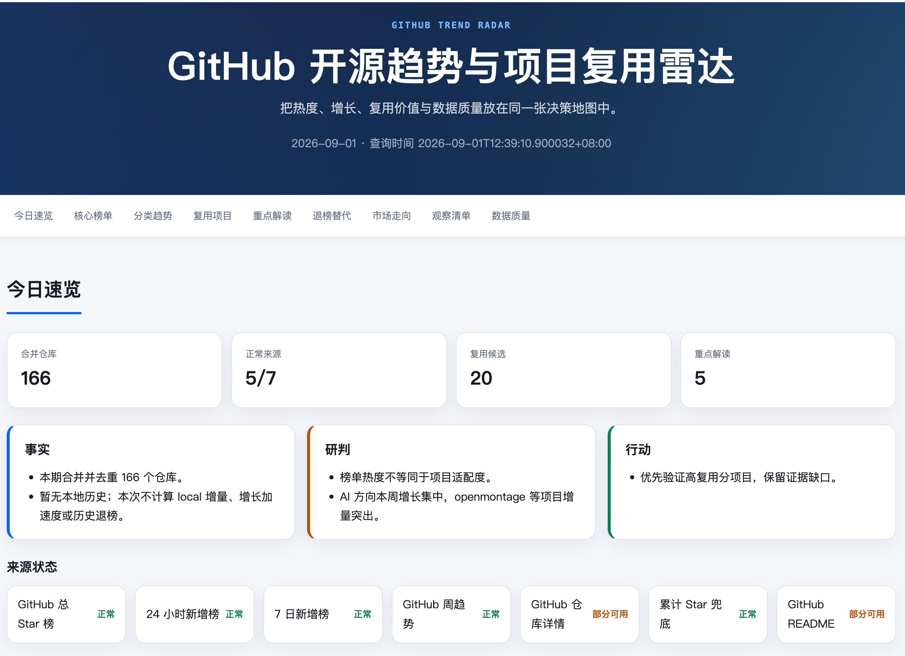

# GitHub 开源趋势雷达

GitHub 开源趋势雷达从 GitHub Trending、GitHub Search 和 OSS Insight 获取数据，生成可复核的开源项目趋势报告，帮助你了解：

- 项目的累计 Star、24 小时增长和 7 天增长；
- 技术分类趋势与项目用途；
- 项目复用价值评分；
- 观察清单维护与历史变化；
- 有证据支持的项目替代关系分析。

本项目既可以作为独立的 Python 命令行工具使用，也可以作为 Codex 技能使用。基础 GitHub API 访问不需要认证；如需更高的 API 速率限制，可以设置环境变量 `GITHUB_TOKEN`。工具不会把 Token、请求头或 Cookie 写入报告。

## 报告页面预览



## 环境要求

- Python 3.10 或更高版本
- `requirements.txt` 中列出的依赖

安装依赖：

```bash
python3 -m pip install -r requirements.txt
```

## 使用方法

在仓库根目录执行：

```bash
python3 scripts/radar.py --help
python3 scripts/radar.py report
python3 scripts/radar.py repo openai/codex
python3 scripts/radar.py compare old-owner/old-repo new-owner/new-repo
python3 scripts/radar.py watchlist
```

可以使用 `--workspace` 指定工作区，或使用 `--output-root` 指定报告资产目录。生成的报告、历史归档、Excel 文件和运行状态默认不纳入版本控制。

随项目提供的 `scripts/run_daily_report.sh` 不依赖特定用户目录。可以通过环境变量配置：

- `RADAR_WORKSPACE`：工作区路径；
- `RADAR_OUTPUT_ROOT`：报告输出路径；
- `RADAR_PY`：`radar.py` 路径；
- `PYTHON_BIN`：Python 解释器路径；
- `CERTIFI_PEM`：可选的 CA 证书路径。

## 数据来源与限制

工具会严格区分数据来源和统计周期。GitHub Search 的 `created_at` 不会被当作 Star 增长的替代指标。数据源不可用时，报告会明确标注降级状态，不会静默伪造缺失数据。GitHub Trending 和 OSS Insight 都是外部服务，其响应格式和速率限制可能发生变化。

## 测试

测试套件使用 Python 标准库 `unittest`：

```bash
python3 -m unittest discover -s tests -p 'test_*.py' -v
```

## Codex 技能

`SKILL.md` 包含 Codex 的触发元数据和工作流说明；`agents/openai.yaml` 提供技能列表中的界面信息；`references/` 包含指标口径和报告结构定义。

## 许可证

本项目采用 MIT 许可证。你可以自由使用、复制、修改、合并、发布、分发、再许可和销售本项目，但再分发时必须保留版权声明和许可证文本。许可证不提供任何明示或默示担保，详见 [LICENSE](LICENSE)。
